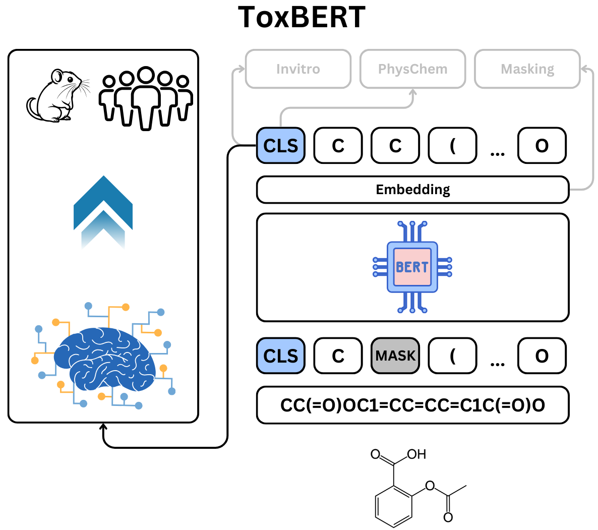

# ToxBERT - Modeling DILI by pretraining BERT on invitro data

This repository contains the code of ToxBERT, a pretrained BERT based model with the ability to use biological and chemical data during pretraining stage

<p align="center">
  
</p>

## Table of Contents
- [Installation](#installation)
- [Data Preparation](#data-preparation)
- [Model Architecture](#model-architecture)
- [Training the Model](#training-the-model)
- [Reproducing Results](#reproducing-results)
- [Making Predictions](#making-predictions)
- [Results](#results)
- [Citation](#citation)

## Installation

1. Clone the repository:
```bash
git clone https://github.com/aidd-msca/ToxBERT.git
cd ToxBERT
```

2. Create and activate a conda environment:
```bash
conda create -y -q -n ToxBERT -c rdkit rdkit=2019.03.1.0 python=3.7.3
conda activate ToxBERT
```
if Aalto University (triton):
```bash
module load mamba # specific to Aalto University (triton)
source activate ToxBERT
```

3. Install dependencies:
```bash
pip install -e . 
```

## Data Preparation

The model requires two types of data:

1. Pretraining data: In-vitro data with binary labels
2. Fine-tuning data: Preclinical and Clinical data with binary labels

### Data Format
The input data should be in pickle (.pkl) format with the following structure:
```python
{
    'SMILES': [...],  # List of SMILES strings
    'property1': [...],  # Binary labels (0 or 1)
    'property2': [...],
    # ... additional properties
}
```

### Example Data Preparation
```python
import pandas as pd

# Load your data
data = pd.read_csv('your_data.csv')

# Process SMILES and properties
processed_data = {
    'SMILES': data['smiles'].values,
    'property1': data['prop1'].values.astype(int),
    'property2': data['prop2'].values.astype(int)
}

# Save as pickle
pd.to_pickle(processed_data, 'processed_data.pkl')
```

Place your prepared data files in the `data/` directory:
```
data/
├── train_set_invitro_1m_300k_ADME_filtered.pkl
├── test_set_invitro_1m_300k_ADME_filtered.pkl
└── pos_weights.csv
```

## Model Architecture

The model consists of three main components:
1. BERT encoder for molecular representation
2. Masked language modeling head for pre-training
3. Task-specific heads for:
   - ADME property prediction
   - Physicochemical property prediction

Architecture details:
- BERT output dimension: 768
- Maximum sequence length: 128
- Hidden layer size: 2048
- Number of attention heads: 12

## Training the Model

1. Configure your training parameters in `config/default_config.yaml`:
```yaml
project_name: "BERT_invitro_pretraining"
model_name: "with_masking_invitro_physchem_heads"
max_epochs: 50
batch_size: 264
lr: 1e-05
```

2. Set up environment variables:
```bash
export MODEL_WEIGHTS_DIR="/path/to/weights"
export DATA_DIR="/path/to/data"
export WANDB_API_KEY="your_wandb_key"  # Optional, for logging
```

3. Start training:
```bash
python scripts/train.py --config config/default_config.yaml
```

## Pretraining by using public data
```bash
# Pretraining data can be downloaded from:
https://figshare.com/articles/dataset/Pretraining_data/28334303
```

## Downstream data and ToxBERT Embeddings
```bash
https://figshare.com/articles/dataset/ToxBERT_-_Pretraining_and_downstream_data/28692518
```

## Citation

If you use this code in your research, please cite:
```bibtex
@article{ToxBERT,
    title={ToxBERT - Modeling DILI by pretraining BERT on invitro data},
    author={Muhammad Arslan Masood, Samuel Kaski, Anamya Ajjolli Nagaraja, Katia Belaid, Natalie Mesens, Hugo Ceulemans, Dorota Herman, Markus Heinonen},
    journal={under review},
    year={2025}
}
```

## License

This project is licensed under the MIT License - see the [LICENSE](LICENSE) file for details.

## Contact

Muhammad Arslan Masood - arslan.asood@aalto.fi